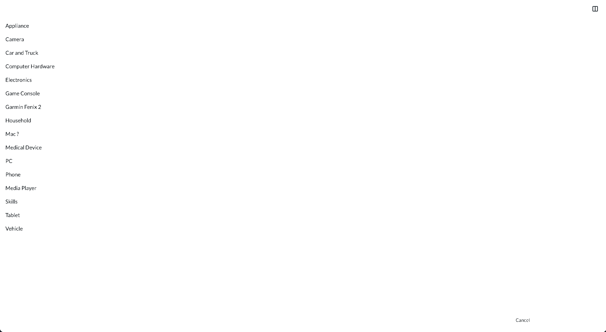

# Device Picker

[](https://www.npmjs.com/package/device-picker)



## Installation

```shell
npm install device-picker
```
## Usage

``` js
import React from 'react';
import { View, DevicePicker } from 'device-picker';
import memoize from 'lodash/memoize';
function MyDevicePicker() {
   return (
         <DevicePicker
            allowOrphan={true}
            initialDevice={'iPhone'}
            initialView={View.Grid}
            fetchHierarchy={() =>
               fetch(
                  'https://www.cominor.com/api/2.0/wikis/CATEGORY?display=hierarchy',
               ).then(response => response.json())
            }
            fetchChildren={
                memoize(title =>
                    fetch(
                        `https://www.cominor.com/api/2.0/wikis/CATEGORY/${title}/children`,
                    ).then(response => response.json()),
                )
            }
            onSubmit={title => alert(`Selected "${title}"`)}
            onCancel={() => alert(`Cancelled`)}
            objectName="device"
         />
   );
}

export default MyDevicePicker;

```

## Props
| Prop           | Type     | Default     | Required | Description                                                                                                           |
|----------------|----------|-------------|----------|-----------------------------------------------------------------------------------------------------------------------|
| allowOrphan    | boolean  | `false`     | No       |                                                                                                                       |
| initialDevice  | string   | `''`        | No       | Default device to load picker with.                                                                                   |
| initialView    | View     | `View.Grid` | No       | Default layout for displaying devices. Available options `View.Grid`, `View.Column`. For IE defaults to `View.Column` |
| fetchHierarchy | function | `undefined` | Yes      | Function to get devices categories                                                                                    |
| fetchChildren  | function | `undefined` | Yes      | Function to get category items                                                                                        |
| onSubmit       | function | `undefined` | Yes      | Function that receives the device title.                                                                              |
| onCancel       | function | `undefined` | Yes      | Function when picker is cancelled.                                                                                    |
| objectName     | string   | `device`    | No       | Singular object name for objects, usually "Device" or "Category".                                                     |

## Sample Integration
- [Standalone App](src/App.tsx) demonstrating device picker.
- [WordPress Block Editor Integration](https://github.com/iFixit/valkyrie/blob/master/site/web/app/themes/valkyrie/resources/assets/scripts/editor/plugins/campaign.js#L56) using device picker to attach device to campaign banner 

## Contributing

### Local development setup

Clone repo
```shell
git clone https://github.com/iFixit/device-picker.git
```

Change directory
```shell
cd device-picker
```

Install dependencies
``` shell
npm install
```

Start dev server
``` shell
npm run dev
```
